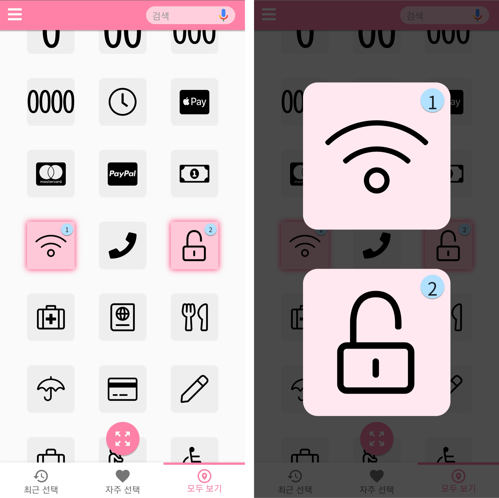

# 픽톡 PicTalk
## 소개
픽톡은 **언어가 아니라 그림으로 소통하는 앱**입니다. 내가 전하고자 하는 의미의 그림 몇 가지를 선택하고, 상대방에게 보여주어 직관적으로 의미를 전달합니다.   
인터넷 환경이 열악하여 번역기를 사용할 수 없는 외국의 오지에 갈 때, 텍스트가 어려운 선천적 청각장애인과 소통할 때 유용합니다.

## 사용해보기
### 데모
픽톡은 현재 네틀리파이를 통해 배포하고 있습니다. [여기를 클릭해 사용해보세요!](https://picktalk.netlify.app/www/)

### 폰갭 CLI
    $ phonegap create my-app --template blank

## 사용 방법
1. 말하고자 하는 의미의 그림 몇 가지를 선택한다.
1. 확대 버튼을 눌러 그림들을 크게 띄우고 상대방에게 보여준다.   

원하는 그림을 세세하게 찾고싶다면 좌측 상단의 **메뉴**에서 원하는 그림의 카테고리를 찾아들어가거나, 하단의 **최근 선택**한 그림과 **자주 선택**했던 그림들을 모아놓은 항목에서 찾을 수 있습니다.

## 개발 동기
인터넷이 잘 보급되지 않은 라오스에서 번역기를 사용하기 어렵습니다. 중국의 소수민족인 어룬춘족의 방언은 번역기에 등록되어있지 않습니다. 아프리카 일부 국가의 번역은 데이터가 적어서 번역기의 정확도가 떨어집니다. 선천적 청각장애인은 한글을 읽기 어려워 합니다([자막 있는데 왜 수여 통역하냐고요?](https://news.kbs.co.kr/news/pc/view/view.do?ncd=5079975)).   

뿐만 아니라 간단한 소통에도 번역기를 사용하면 일일이 타자를 입력하거나, 음성인식 때문에 시간이 오래 걸리는 점 역시 문제점 입니다. 더불어 작은 오타에도 의미가 완전히 뒤바뀔 수 있죠.   

이러한 문제점 속에서 저는 **"그림으로 소통해보면 어떨까?"** 라는 생각으로 이 앱을 기획했습니다.

## 영감
- 서울수어전문교육원 고급반2
- 트립 티셔츠 Trip tshirt